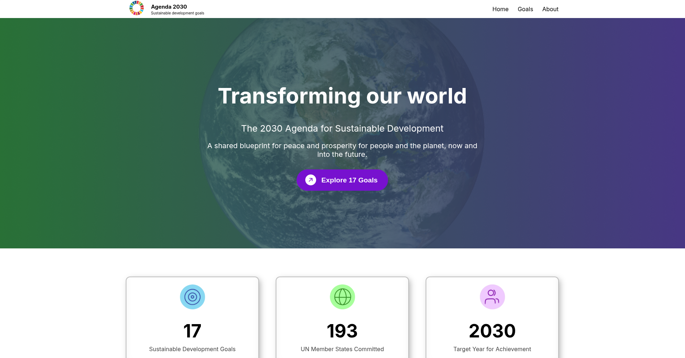

# Agenda 2030 - Web

Progetto scolastico informatico di gruppo, con lo scopo di creare un sito web informativo sull'Agenda 2030 e i suoi obiettivi.

## Anteprima

## Cos'è l'Agenda 2030

L'Agenda 2030 è un programma globale adottato dall'ONU nel 2015 che comprende 17 obiettivi di sviluppo sostenibile per migliorare il futuro del pianeta.

## Obiettivi del progetto

- Sensibilizzare sui temi ambientali
- Applicare conoscenze di HTML, CSS e JavaScript
- Collaborare in gruppo

## Installazione

Scaricare il file .zip dalla repository, navigare nella cartella docs e aprire il file index.html con un browser.

## Include condivisi (navbar e footer)

Navbar e footer sono stati centralizzati in `docs/navbar.html` e `docs/footer.html` e caricati nelle pagine tramite JavaScript (`fetch`).
Per vedere correttamente gli include, avviare il progetto con un server locale (ad esempio `python -m http.server` nella cartella `docs`).

## Tecnologie

- HTML
- CSS
- JavaScript

## Contributi

_Ringraziamenti a chi ha lavorato sul progetto_

* [Umut Hastan](https://github.com/Clopezio) 

## Licenza

Questo progetto ha scopo didattico, segue la licenza MIT.
